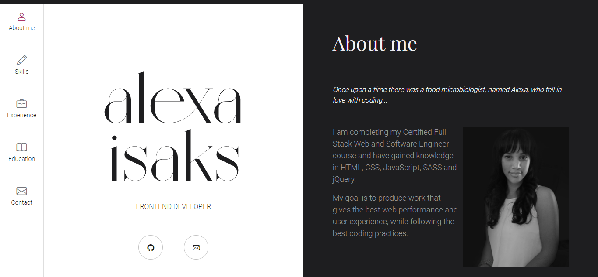
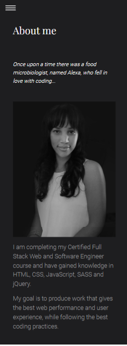
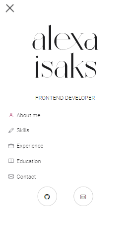

<h1 align="center">My CV</h1>

Create an online Curriculum Vitae.

## Table of Contents

* [About the Project](#about-the-project)
* [Installation](#installation)
* [Usage](#usage)
* [Acknowledgments](#acknowledgments)

## About the Project

 

The purpose of the project is to create an online CV.

## Installation

* Open Git Bash.
* Change to the directory/folder where you want to clone the repository.
* Enter `git clone https://github.com/AlexaIsaks/MyCV.git`

## Usage

* Open the project in your favourite code editor.
* Open the `index.html` file.
* If you are using Visual Studio Code, view the project using **Live Server**.

 

 
 

 
 

## Acknowledgments

**HyperionDev**

Certified Full Stack Web and Software Engineer 